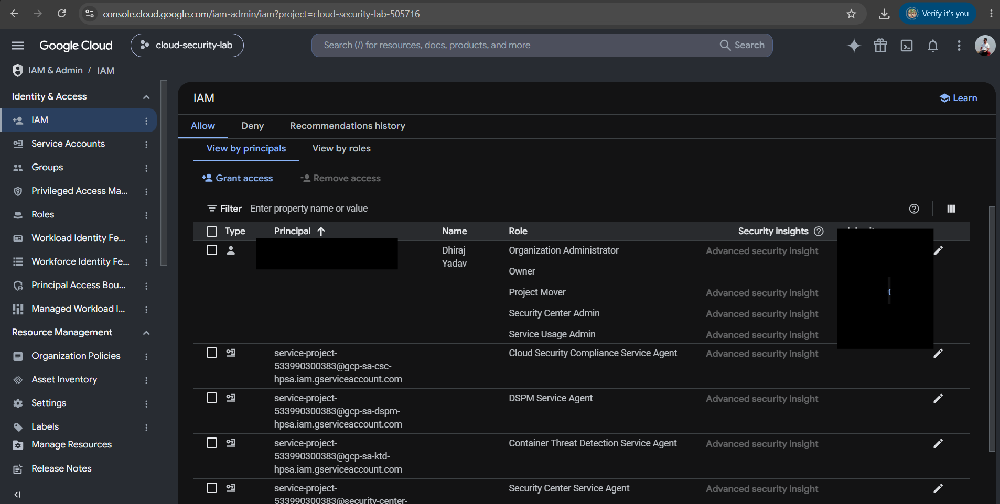

# GCP Project Setup

## Objective

Create a Google Cloud project and understand the basic structure and
purpose of a GCP project.

## What I Explored

- Created a GCP project
- Explored the GCP Console
- Examined the project dashboard
- Identified Project Name
- Identified Project ID
- Identified Project Number
- Explored project configuration
- Reviewed available Google Cloud services and APIs

## Key Concepts

### Project Name

Human-readable name used to identify the project.

### Project ID

Globally unique identifier used to reference the project through
Google Cloud APIs, CLI commands, and other tooling.

### Project Number

Google-generated numeric identifier associated with the project.

## Engineering Perspective

A GCP project provides an important boundary for organizing,
managing, securing, and operating cloud resources.

Projects also provide a natural boundary for:

- IAM policies
- Resource management
- Service enablement
- Billing association
- Operational ownership
- Security controls

## Key Takeaways

- Project ID and Project Number are different identifiers.
- Cloud resources are organized under projects.
- Project configuration influences which services and APIs can be used.
- Projects are an important unit of organization and isolation in GCP.

## Evidence

Screenshots demonstrating the project exploration are maintained separately 

## Next

Explore GCP IAM and understand how principals, roles, permissions,
and IAM policies control access to project resources.