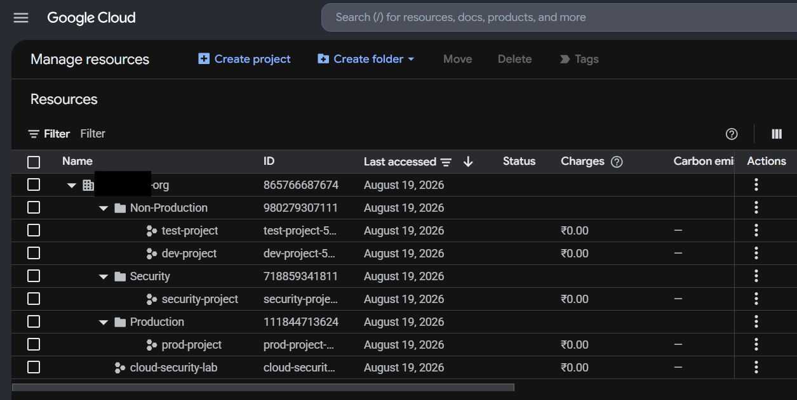

# GCP Enterprise Hierarchy

## Objective

Build an initial enterprise GCP resource hierarchy separating **production, non-production, and security workloads**.

## Hierarchy

Organization
├── Production
│   └── prod-project
├── Non-Production
│   ├── dev-project
│   └── test-project
├── Security
│   └── security-project
└── cloud-security-lab

## What I Built

- Organization-level hierarchy
- Production and non-production separation
- Dedicated security folder
- Projects under appropriate folders
- Existing project retained at organization level

## Key Takeaways

- **Folders** provide organizational and policy boundaries.
- **Projects** provide workload and administrative boundaries.
- Separating production from non-production reduces blast radius.
- IAM and organization policies can be inherited through the hierarchy.

## Evidence

### GCP Resource Hierarchy

## References

- [Google Cloud Resource Hierarchy](https://cloud.google.com/resource-manager/docs/cloud-platform-resource-hierarchy)
- [Google Cloud IAM](https://cloud.google.com/iam/docs)