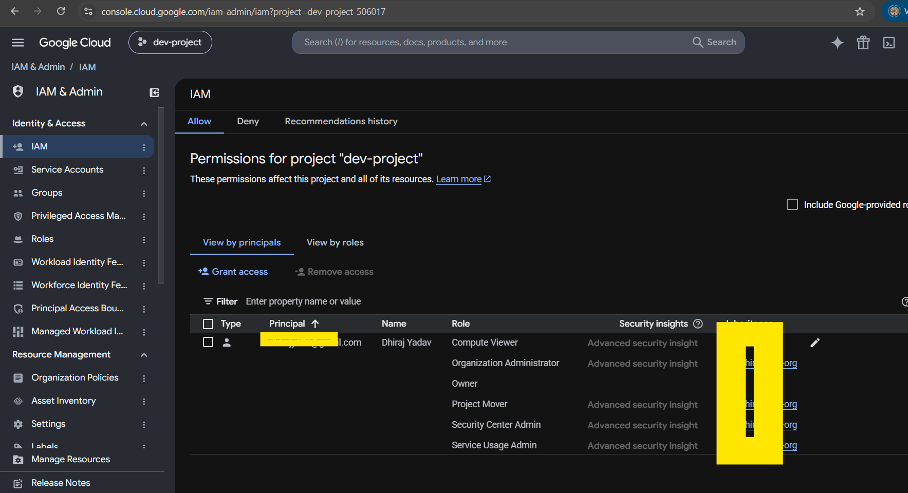
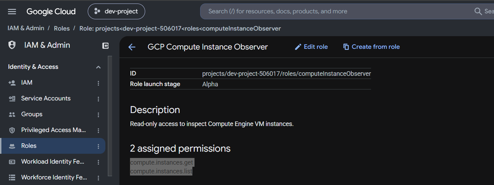
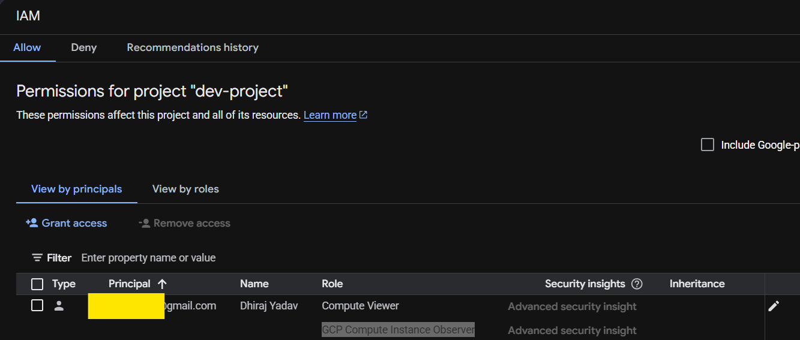
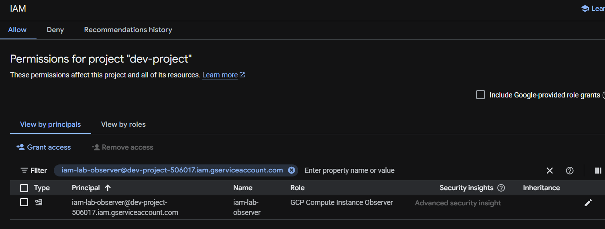

# GCP IAM Role Matrix

## Objective

Document IAM principals, roles, permissions, scope, and least-privilege design.

## Role Matrix

| Principal | Scope | Role | Key Permissions | Purpose |
|---|---|---|---|---|
| `dhirajy076@gmail.com` | `dev-project` | Compute Viewer | Compute read permissions | Demonstrate predefined role |
| `dhirajy076@gmail.com` | `dev-project` | GCP Compute Instance Observer | `compute.instances.get`, `compute.instances.list` | Demonstrate custom least-privilege role |
| `iam-lab-observer@...` | `dev-project` | GCP Compute Instance Observer | `compute.instances.get`, `compute.instances.list` | Dedicated least-privilege principal |
| `gcp-developers@...` | Non-Production | Design only | Project-specific developer permissions | Enterprise group-based IAM model |

## Custom Role

**GCP Compute Instance Observer**

Permissions:

- `compute.instances.get`
- `compute.instances.list`

The role intentionally excludes state-changing permissions such as:

- `compute.instances.start`
- `compute.instances.stop`
- `compute.instances.delete`

## Least-Privilege Model

Principal
  ↓
IAM Policy Binding
  ↓
Custom Role
  ↓
Required Permissions
  ↓
Specific Project

The dedicated service account demonstrates a clean least-privilege principal with only the permissions required to inspect Compute Engine instances.

## Group-Based IAM

Group-based IAM was designed but not implemented because the current GCP organization is not domain-verified and therefore does not support creating Google Cloud Identity groups through the console.

Conceptual model:

Google Group
  ↓
IAM Role
  ↓
Non-Production Folder
  ↓
Projects

## Key Takeaways

- Predefined roles provide reusable Google-managed permission sets.
- Custom roles allow more granular permission control.
- IAM bindings connect principals to roles at a specific resource scope.
- Least privilege means granting only the permissions required for a task.
- Dedicated service accounts are useful for testing and enforcing narrow access.
- Group-based IAM is preferred for scalable enterprise access management.
- IAM scope and inheritance should be considered when designing access.

## Evidence

### Predefined Role Binding

### Custom Role Definition

### Custom Role Binding

### Least-Privilege Service Account

## References

- [Google Cloud IAM](https://cloud.google.com/iam/docs)
- [IAM Roles](https://cloud.google.com/iam/docs/roles-overview)
- [Custom IAM Roles](https://cloud.google.com/iam/docs/creating-custom-roles)
- [IAM Best Practices](https://cloud.google.com/iam/docs/best-practices)