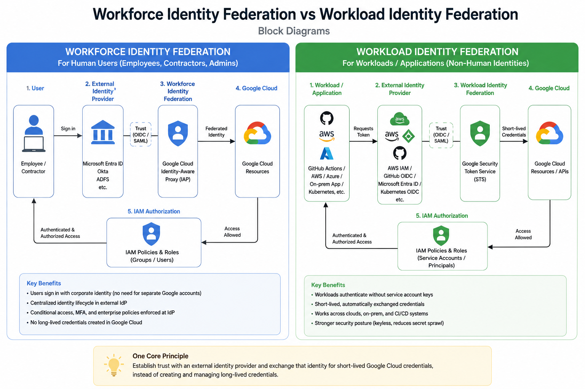

# Workforce Identity Federation vs Workload Identity Federation

## Overview

This study compares **Workforce Identity Federation** and **Workload Identity Federation** in Google Cloud.

Both mechanisms allow identities outside Google Cloud to access Google Cloud resources without relying on traditional long-lived credentials.

The key distinction is:

> **Workforce Identity Federation is designed for human users, while Workload Identity Federation is designed for workloads and applications.**

The common security principle is to establish trust with an external identity provider and use **short-lived credentials** instead of creating and managing long-lived credentials.

---

## Architecture Diagram



---

## 1. Workforce Identity Federation

### Purpose

Workforce Identity Federation allows employees, contractors, and other human users to access Google Cloud using identities managed by an external identity provider.

Instead of creating and maintaining separate Google identities for every user, an organization can federate its existing enterprise identity system with Google Cloud.

### Typical Identity Providers

Examples include:

* Microsoft Entra ID
* Okta
* Active Directory Federation Services (AD FS)
* Other OIDC- or SAML-compatible identity providers

### High-Level Flow

```text
User
  |
  v
Corporate Identity Provider
(Entra ID / Okta / AD FS)
  |
  | Authentication
  v
Workforce Identity Federation
  |
  | Federated Identity
  v
Google Cloud
  |
  v
IAM Authorization
  |
  v
Google Cloud Resources
```

### Example

An employee authenticates using the company's Microsoft Entra ID account.

```text
Employee
   |
   v
Microsoft Entra ID
   |
   | OIDC / SAML
   v
Workforce Identity Federation
   |
   v
Google Cloud
   |
   v
IAM Policies / Roles
   |
   v
GCP Resources
```

The user can therefore access authorized Google Cloud resources without requiring a separate Google-managed user identity for authentication.

---

## 2. Workload Identity Federation

### Purpose

Workload Identity Federation allows applications and workloads running outside Google Cloud to access Google Cloud resources without storing long-lived Google Cloud service account keys.

This is particularly useful for:

* CI/CD pipelines
* GitHub Actions
* AWS workloads
* Azure workloads
* On-premises applications
* Kubernetes workloads
* Multi-cloud environments

### Typical External Identity Sources

Examples include:

* GitHub Actions OIDC
* AWS IAM
* Microsoft Azure
* Kubernetes/OIDC providers
* Other supported OIDC or SAML identity providers

### High-Level Flow

```text
External Workload
       |
       v
External Identity Provider
       |
       | OIDC / SAML / Cloud Identity
       v
Workload Identity Federation
       |
       v
Google Security Token Service
       |
       | Short-lived credentials
       v
Google Cloud APIs
       |
       v
IAM Authorization
```

### Example: GitHub Actions

A GitHub Actions workflow can authenticate to Google Cloud using GitHub's OIDC token.

```text
GitHub Actions
      |
      | OIDC Token
      v
Workload Identity Pool / Provider
      |
      v
Google Security Token Service
      |
      | Short-lived credentials
      v
Google Cloud
      |
      v
IAM Authorization
      |
      v
Cloud Run / GCS / Artifact Registry / etc.
```

No long-lived Google Cloud service account key needs to be stored as a GitHub secret.

---

## 3. Workforce vs Workload Identity Federation

| Aspect                             | Workforce Identity Federation                 | Workload Identity Federation                 |
| ---------------------------------- | --------------------------------------------- | -------------------------------------------- |
| Primary purpose                    | Federate human identities                     | Federate workload identities                 |
| Identity type                      | Human                                         | Non-human / workload                         |
| Typical subject                    | Employee / contractor / administrator         | Application / CI/CD pipeline / service       |
| Example IdP                        | Entra ID, Okta, AD FS                         | GitHub OIDC, AWS, Azure, Kubernetes          |
| Authentication                     | External IdP                                  | External workload identity                   |
| Google Cloud access                | User-level access                             | Application/API access                       |
| IAM authorization                  | Users, groups, federated principals           | Federated principals and/or service accounts |
| Common use case                    | Employee accessing GCP                        | CI/CD deploying to GCP                       |
| Long-lived service-account key     | Not required                                  | Not required                                 |
| Main security benefit              | Centralized workforce identity                | Keyless workload authentication              |
| Primary security concern addressed | Identity duplication and lifecycle management | Service-account key exposure                 |
| Mental model                       | **Human → IdP → GCP**                         | **Workload → IdP → GCP**                     |

---

## 4. Key Architectural Difference

The simplest way to remember the difference:

```text
WORKFORCE
Human
  ↓
External Identity Provider
  ↓
Workforce Identity Federation
  ↓
Google Cloud
  ↓
IAM
```

```text
WORKLOAD
Application / CI-CD
  ↓
External Identity Provider
  ↓
Workload Identity Federation
  ↓
Google Security Token Service
  ↓
Google Cloud
  ↓
IAM
```

### In one sentence

> **Workforce Identity Federation answers "Who is this person?" while Workload Identity Federation answers "What workload is making this request?"**

---

## 5. Why Federation Matters

Traditional authentication models often rely on credentials that are stored and managed directly by applications or users.

For example:

```text
Application
    |
    v
Service Account JSON Key
    |
    v
Google Cloud
```

This creates security risks because the key may be:

* Accidentally committed to source control
* Exposed through CI/CD logs
* Copied between systems
* Stolen through credential compromise
* Difficult to rotate consistently
* Difficult to track across environments

Federation changes the model:

```text
External Identity
       |
       v
Federation
       |
       v
Short-Lived Credentials
       |
       v
Google Cloud
```

This reduces the dependency on long-lived secrets.

---

## 6. Workforce Identity Federation Security Model

The major security advantages include:

### Centralized Authentication

Authentication remains under the organization's existing identity provider.

```text
Corporate IdP
    |
    +-- MFA
    +-- Conditional Access
    +-- Device Policies
    +-- User Lifecycle
    |
    v
Google Cloud
```

This allows enterprise identity controls to remain centralized.

### Centralized Lifecycle Management

When an employee leaves the organization, disabling the identity at the enterprise IdP can prevent further federated access.

This reduces the need to separately manage equivalent identities across multiple cloud environments.

---

## 7. Workload Identity Federation Security Model

The primary security benefit is **keyless authentication**.

Traditional approach:

```text
CI/CD
  |
  v
Service Account Key
  |
  v
Google Cloud
```

Federated approach:

```text
CI/CD
  |
  v
OIDC Token
  |
  v
Workload Identity Federation
  |
  v
Short-Lived Credentials
  |
  v
Google Cloud
```

The workload does not need to permanently store a Google Cloud service account private key.

---

## 8. IAM Authorization Still Matters

Federation handles **authentication and identity establishment**.

IAM determines **what the authenticated identity is allowed to do**.

Conceptually:

```text
                Authentication
                     |
                     v
        +-------------------------+
        | External Identity       |
        | Provider                |
        +-------------------------+
                     |
                     v
              Federation
                     |
                     v
             Federated Identity
                     |
                     v
        +-------------------------+
        | Google Cloud IAM        |
        |                         |
        | Roles                   |
        | Permissions             |
        | Conditions              |
        +-------------------------+
                     |
                     v
             GCP Resources
```

Therefore:

> **Federation does not replace IAM. Federation establishes identity; IAM provides authorization.**

---

## 9. Zero Trust Perspective

Both federation mechanisms align with Zero Trust principles.

### Workforce

```text
Don't automatically trust:
    "User is inside corporate network"

Instead:
    Authenticate user
        ↓
    Validate external identity
        ↓
    Apply IAM authorization
        ↓
    Grant only required access
```

### Workload

```text
Don't automatically trust:
    "Application is running in our CI/CD system"

Instead:
    Validate workload identity
        ↓
    Verify trusted attributes
        ↓
    Apply IAM authorization
        ↓
    Grant only required permissions
```

The important principle is:

> **Identity is established explicitly, and authorization is evaluated separately.**

---

## 10. Comparison of Credential Models

### Traditional Workforce Model

```text
User
 ↓
Google Account
 ↓
Password / MFA
 ↓
Google Cloud
```

### Federated Workforce Model

```text
User
 ↓
Enterprise IdP
 ↓
Federation
 ↓
Google Cloud
```

### Traditional Workload Model

```text
Application
 ↓
Service Account
 ↓
Long-Lived Private Key
 ↓
Google Cloud
```

### Federated Workload Model

```text
Application
 ↓
External Identity / OIDC
 ↓
Workload Identity Federation
 ↓
Short-Lived Credentials
 ↓
Google Cloud
```

---

## 11. Real-World Use Cases

### Workforce Identity Federation

**Scenario:** Enterprise employees use Microsoft Entra ID.

```text
Employee
   ↓
Microsoft Entra ID
   ↓
Workforce Identity Federation
   ↓
Google Cloud
   ↓
IAM
   ↓
GCP Console / APIs
```

Useful when an organization wants:

* Centralized employee authentication
* Existing enterprise MFA
* Existing identity lifecycle management
* Reduced duplicate identities
* Consistent access governance

---

### Workload Identity Federation

**Scenario:** GitHub Actions deploys an application to Cloud Run.

```text
GitHub Actions
      ↓
GitHub OIDC Token
      ↓
Workload Identity Federation
      ↓
Short-Lived Credentials
      ↓
Google Cloud
      ↓
Cloud Run
```

Useful when an organization wants:

* Keyless CI/CD authentication
* Multi-cloud workload access
* Secure external workload access
* Reduced secret management
* Short-lived credentials

---

## 12. Security Engineering Takeaways

### 1. Authentication and authorization are separate

Federation establishes trust in an external identity.

IAM determines what that identity can access.

### 2. Prefer short-lived credentials

Long-lived credentials increase the impact and persistence of credential compromise.

### 3. Reduce secret sprawl

Workload Identity Federation can eliminate the need to distribute Google Cloud service-account private keys to external workloads.

### 4. Use least privilege

Federated identities should receive only the IAM roles and permissions required for their tasks.

### 5. Attribute-based trust is important

Federation should not simply mean:

```text
"External identity = trusted"
```

The trust relationship should be constrained using appropriate identity attributes and IAM policies.

### 6. Federation supports Zero Trust

The external origin of a user or workload does not automatically grant access.

Identity must be established and authorization evaluated.

---

## 13. Mental Model

The easiest way to remember the entire topic:

```text
             FEDERATION
                  |
       +----------+----------+
       |                     |
       v                     v
   WORKFORCE              WORKLOAD
       |                     |
       v                     v
    Humans              Applications
       |                     |
       v                     v
   External IdP          External IdP
       |                     |
       v                     v
   Google Cloud          Google Cloud
       |                     |
       +----------+----------+
                  |
                  v
                 IAM
                  |
                  v
             Resources
```

### Remember

**Workforce Identity Federation**

> Human identity → External IdP → Google Cloud → IAM

**Workload Identity Federation**

> Workload identity → External IdP → Google Cloud → IAM

---

## Conclusion

Workforce Identity Federation and Workload Identity Federation solve similar architectural problems but target different identity types.

**Workforce Identity Federation** is primarily concerned with securely bringing **human identities** from an external enterprise identity provider into Google Cloud.

**Workload Identity Federation** is primarily concerned with securely bringing **application and workload identities** from external environments into Google Cloud without relying on long-lived service-account keys.

The broader security engineering principle is:

> **Establish trust with an external identity provider, use short-lived credentials where applicable, and enforce authorization through least-privilege IAM policies.**

This makes federation an important building block for modern **Zero Trust, multi-cloud, CI/CD, and cloud security architectures**.

---

## Key Terms

* Workforce Identity Federation
* Workload Identity Federation
* Identity Provider (IdP)
* OIDC
* SAML
* Identity Pool
* Identity Provider Configuration
* Federated Identity
* Google Security Token Service (STS)
* Short-Lived Credentials
* Service Account
* IAM
* Least Privilege
* Zero Trust
* Keyless Authentication
* CI/CD Identity
* Multi-Cloud Identity

---

## Study Status

| Item                          | Status                                 |
| ----------------------------- | -------------------------------------- |
| Workforce Identity Federation | Studied                                |
| Workload Identity Federation  | Studied                                |
| Architecture comparison       | Completed                              |
| Block diagram                 | Completed                              |
| Security implications         | Studied                                |
| IAM relationship              | Studied                                |
| Real-world use cases          | Studied                                |
| Hands-on implementation       | Not performed                          |
| Evidence                      | Comparison note + architecture diagram |
