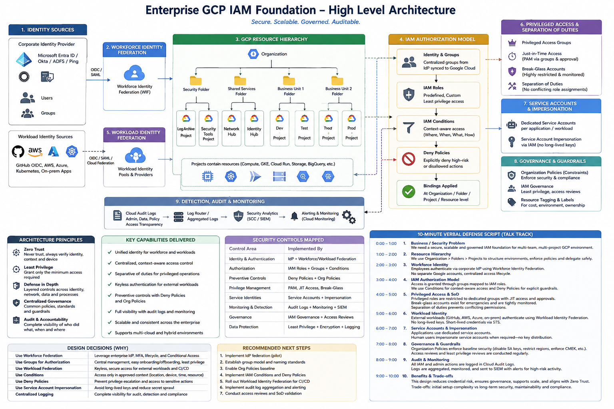

# Enterprise GCP IAM Foundation

## Architecture Gate

| Item | Details |
|---|---|
| **Focus** | Gate |
| **Task** | Write and defend the Enterprise GCP IAM Foundation architecture |
| **Type** | Architecture |
| **Deliverable / Evidence** | HLD + 10-minute verbal explanation |
| **Status** | Architecture design completed |

---

## 1. Objective

Design a scalable, secure, governed, and auditable IAM foundation for an enterprise Google Cloud environment.

The architecture is designed around:

- Centralized enterprise identity
- Workforce Identity Federation
- Workload Identity Federation
- Hierarchical GCP resource organization
- Group-based IAM
- Least-privilege authorization
- IAM Conditions
- IAM Deny Policies
- Privileged access controls
- Service-account impersonation
- Organization Policies
- Centralized audit logging and monitoring

The core security principle is:

> **Establish identity centrally, authorize through least privilege, constrain access with preventive controls, and maintain complete auditability.**

---

## 2. High-Level Architecture



---

## 3. Architecture Components

### 3.1 Enterprise Identity Provider

The corporate Identity Provider is the authoritative source for workforce identities.

Examples:

- Microsoft Entra ID
- Okta
- AD FS

The IdP manages:

- User lifecycle
- Groups
- Authentication
- MFA
- Conditional Access
- Employee onboarding/offboarding

Google Cloud should not become a second independent source of truth for workforce identity.

---

### 3.2 Workforce Identity Federation

Workforce Identity Federation allows human users to access Google Cloud using their existing enterprise identity.

```text
Employee
   |
   v
Corporate IdP
   |
   | OIDC / SAML
   v
Workforce Identity Federation
   |
   v
Google Cloud
   |
   v
IAM Authorization
```

Benefits:

- Centralized authentication
- Existing MFA and enterprise policies
- Reduced identity duplication
- Centralized lifecycle management

---

### 3.3 GCP Resource Hierarchy

The enterprise GCP environment is organized using the resource hierarchy:

```text
Organization
    |
    +-- Security Folder
    |      +-- Logging Project
    |      +-- Security Tools Project
    |
    +-- Shared Services Folder
    |      +-- Network Hub
    |      +-- Identity Hub
    |
    +-- Business Unit 1
    |      +-- Dev
    |      +-- Test
    |      +-- Prod
    |
    +-- Business Unit 2
           +-- Dev
           +-- Test
           +-- Prod
```

The hierarchy provides a natural boundary for:

- IAM inheritance
- Organization Policies
- Governance
- Network architecture
- Logging
- Administrative delegation

---

## 4. IAM Authorization Model

Authorization follows a layered model:

```text
Identity
   |
   v
Groups / Federated Principals
   |
   v
IAM Roles
   |
   v
IAM Conditions
   |
   v
Deny Policies
   |
   v
Resource Access
```

### Groups

Prefer granting access to groups rather than individual users.

Benefits:

- Centralized administration
- Easier onboarding/offboarding
- Reduced IAM policy sprawl
- Better auditability
- Consistent access governance

### IAM Roles

Use predefined roles wherever possible.

Use custom roles only where predefined roles do not satisfy the least-privilege requirement.

### IAM Conditions

Use conditions when authorization needs additional context such as:

- Resource
- Time
- Request attributes
- Environment

Example design principle:

```text
Developer Group
      |
      v
Role
      |
      v
Condition
      |
      v
Only approved resource / context
```

### IAM Deny Policies

Use deny policies as explicit guardrails for high-risk or prohibited permissions.

Conceptually:

```text
Allow Policy
     +
Deny Policy
     =
Effective Authorization
```

Deny policies provide a preventive control that can block specific permissions even when an identity receives them through an allow path.

---

## 5. Workload Identity Federation

External workloads should authenticate without long-lived Google Cloud service-account keys.

Typical sources include:

- GitHub Actions
- AWS workloads
- Azure workloads
- Kubernetes
- On-premises applications

High-level flow:

```text
External Workload
       |
       v
External Identity
       |
       v
Workload Identity Federation
       |
       v
Google Security Token Service
       |
       | Short-lived credentials
       v
Google Cloud APIs
       |
       v
IAM Authorization
```

This supports keyless authentication and reduces secret sprawl.

---

## 6. Service Accounts and Impersonation

Service accounts represent application and service identities inside Google Cloud.

Design principles:

- Dedicated service account per application/workload where appropriate
- Avoid shared service accounts
- Avoid long-lived service-account keys
- Prefer service-account impersonation
- Grant only required roles
- Audit service-account usage

Conceptual model:

```text
Application
    |
    | IAM-authorized impersonation
    v
Service Account
    |
    v
Short-lived credentials
    |
    v
GCP Resource
```

---

## 7. Privileged Access

Privileged access requires additional controls.

Recommended architecture:

```text
Privileged User
      |
      v
Privileged Access Group
      |
      v
JIT / PAM Approval
      |
      v
Privileged IAM Role
      |
      v
Target Resource
```

Controls include:

- Dedicated privileged groups
- Just-in-time access
- Approval workflows
- Break-glass accounts
- Strong authentication
- Monitoring
- Regular access reviews
- Separation of duties

Break-glass accounts should be tightly restricted, protected, and continuously monitored.

---

## 8. Governance and Guardrails

Organization-level governance provides preventive controls across the enterprise.

Examples include:

- Organization Policies
- Resource hierarchy standards
- IAM governance
- Access review processes
- Resource tagging and labeling
- Environment separation
- Regional restrictions where appropriate
- Service-account key restrictions
- Security baseline policies

Governance should be centralized while allowing controlled delegation to business units.

---

## 9. Audit, Detection and Monitoring

IAM activity must be observable.

Recommended architecture:

```text
GCP Resources
      |
      v
Cloud Audit Logs
      |
      v
Centralized Log Routing
      |
      +------------------+
      |                  |
      v                  v
Security Analytics      SIEM
      |
      v
Alerting / Monitoring
```

Monitor especially for:

- IAM policy changes
- Privileged role assignments
- Service-account changes
- Service-account impersonation
- Deny-policy changes
- Organization Policy changes
- Workforce federation changes
- Workload federation changes
- Break-glass account activity

---

## 10. Architecture Principles

### Zero Trust

Never assume trust based on network location or workload origin.

### Least Privilege

Grant only the permissions required to perform the task.

### Defense in Depth

Use multiple layers:

```text
Identity
  +
Federation
  +
IAM
  +
Conditions
  +
Deny Policies
  +
Organization Policies
  +
Logging
  +
Monitoring
```

### Centralized Governance

Enterprise-wide controls should be centrally governed while allowing controlled delegation.

### Keyless Authentication

Prefer federation and short-lived credentials over long-lived secrets.

### Auditability

Every privileged and security-sensitive action should be observable and attributable.

---

## 11. Key Design Decisions

| Decision | Rationale |
|---|---|
| External IdP for workforce identity | Centralized identity lifecycle and enterprise authentication |
| Workforce Identity Federation | Avoid separate workforce identity silos |
| Group-based authorization | Scalable access administration |
| IAM Conditions | Context-aware authorization |
| IAM Deny Policies | Explicit preventive guardrails |
| Workload Identity Federation | Keyless external workload authentication |
| Service-account impersonation | Reduce long-lived credential exposure |
| Organization Policies | Enterprise-wide preventive controls |
| Centralized audit logging | Detection, investigation and compliance |
| Dedicated privileged groups | Reduce standing privileged access |
| JIT/PAM controls | Minimize privileged access duration |
| Break-glass accounts | Maintain emergency access without normal standing privilege |

---

## 12. Security Control Mapping

| Control Area | Architecture Control |
|---|---|
| Identity | Corporate IdP |
| Workforce Authentication | Workforce Identity Federation |
| Workload Authentication | Workload Identity Federation |
| Authorization | IAM roles and groups |
| Contextual Authorization | IAM Conditions |
| Preventive Authorization | IAM Deny Policies |
| Governance | Organization Policies |
| Privileged Access | JIT/PAM, privileged groups |
| Emergency Access | Break-glass accounts |
| Application Identity | Service Accounts |
| Credential Security | Impersonation / short-lived credentials |
| Detection | Cloud Audit Logs |
| Monitoring | Centralized logging / SIEM |
| Access Governance | Periodic access reviews |

---

## 13. Trade-offs

### Benefits

- Stronger centralized identity model
- Reduced credential and secret sprawl
- Scalable IAM administration
- Better least-privilege enforcement
- Stronger privileged-access controls
- Improved auditability
- Consistent enterprise guardrails
- Supports hybrid and multi-cloud environments

### Trade-offs

- Initial architecture and integration complexity
- Federation configuration requires careful trust design
- IAM policy design becomes more sophisticated
- Poor group or role design can create access-management complexity
- Centralized controls require clear ownership and governance
- Troubleshooting federated authentication requires understanding both the external IdP and GCP

The architecture intentionally accepts higher initial complexity in exchange for stronger long-term security, scalability, and governance.

---

## 14. Defense Summary

The architecture can be summarized in five statements:

1. **Identity comes from trusted enterprise or workload identity providers.**
2. **Federation provides secure identity establishment without unnecessary long-lived credentials.**
3. **IAM groups and roles provide least-privilege authorization.**
4. **Conditions, Deny Policies, Organization Policies and privileged-access controls provide defense in depth.**
5. **Audit Logs and centralized monitoring provide accountability and detection.**

---

## 15. Gate Completion Criteria

| Requirement | Evidence | Status |
|---|---|---|
| Enterprise IAM architecture | HLD diagram | Completed |
| Workforce identity | Federation design | Completed |
| Workload identity | Federation design | Completed |
| IAM authorization | Groups + roles + conditions | Completed |
| Preventive controls | Deny Policies + Org Policies | Completed |
| Privileged access | JIT/PAM + break-glass | Completed |
| Service identities | Service accounts + impersonation | Completed |
| Auditability | Audit Logs + monitoring | Completed |
| Architecture rationale | Design decisions | Completed |
| 10-minute verbal defense | Defense script | Completed |

---

## Final Takeaway

The Enterprise GCP IAM Foundation is not a collection of individual IAM features.

It is a layered security architecture:

```text
                    Enterprise Identity
                           |
              +------------+------------+
              |                         |
              v                         v
        Workforce Federation     Workload Federation
              |                         |
              +------------+------------+
                           |
                           v
                    GCP Resource Hierarchy
                           |
                           v
                  IAM Groups / Principals
                           |
                           v
                       IAM Roles
                           |
              +------------+------------+
              |                         |
              v                         v
       IAM Conditions            Deny Policies
              |                         |
              +------------+------------+
                           |
                           v
                 Privileged Access
                           |
                           v
                 GCP Resource Access
                           |
                           v
                  Audit & Monitoring
```

The target state is:

> **Secure. Scalable. Governed. Auditable.**
